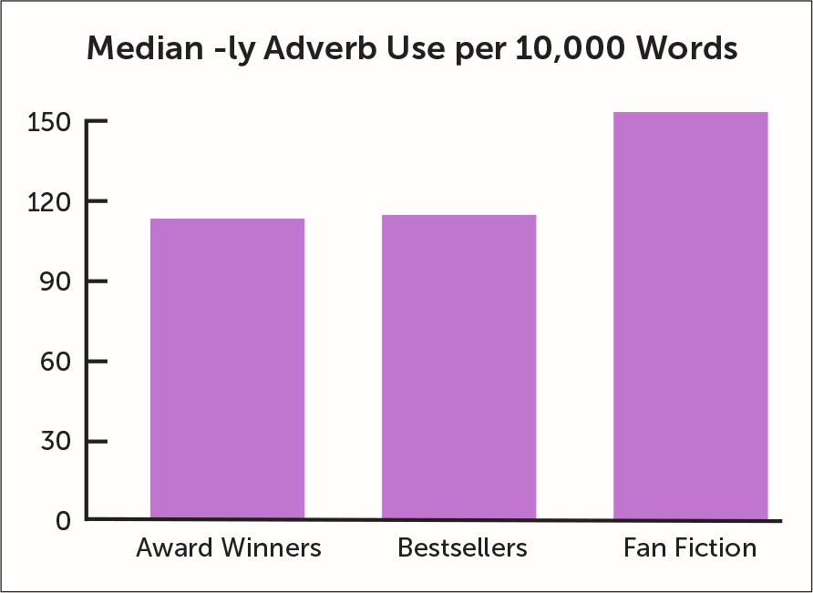

```{css, echo=FALSE}
body {
  padding-bottom: 52px;
}
```

<h6><a href="mailto:nidiahernandez@conicet.gov.ar" class="email">nidiahernandez@conicet.gov.ar</a></h6>
<hr align="left" style="width:40%">

En esta ejercitación vamos a:

* poner en práctica herramientas de etiquetado morfosintáctico de textos
* identificar los sustantivos más frecuentes de un texto y los lemas de los verbos más frecuentes
* detectar las coocurrencias más frecuentes
* graficar los resultados 

## Etiquetado morfosintáctico o _POS tagging_

El etiquetado morfosintáctico es un procedimiento de anotación automática en el que se le asigna una etiqueta de categoría gramatical (o parte del discurso, _part-of-speech_) a cada token de un texto. En el ámbito de la estilometría, permite, por ejemplo, insvestigar la correlación entre el uso de adverbios y calidad de escritura:



*Fig. 1. Promedio de uso de adverbios en obras galardonadas, best-sellers y fan fiction calculado por Ben Blatt en _Nabokov's favourite word is mauve_ (2017)*

En esta práctica, veremos paso a paso cómo realizar el etiquetado morfosintáctico, cómo acceder a los resultados y cómo graficarlos, usando nuestro ya conocido _Relación de un viaje al Río de la Plata_ de Acarette du Biscay. Usaremos el txt disponible [online](https://raw.githubusercontent.com/hdcaicyt/Estilometria-con-R/gh-pages/corpus/DuBiscay_RelDeUnViaje.txt). Para más información sobre el texto, es posible consultar la edición digital en línea en <http://hdlab.space/Relacion-de-un-viaje/>.

### Instalación y uso básico de `udpipe`

Como de costumbre, antes de emprender la lectura de datos y los procesamientos, comenzamos con las instalaciones y la carga de paquetes. En esta ejercitación vamos a servirnos de `udpipe`, una cadena de tratamiento (_pipeline_) para realizar tareas de procesamiento del lenguage natural desarrollada en 2017 por el Instituto de Lingüística Aplicada y Formal de Charles University de la República Checa. Es una herramienta muy potente que permite realizar tokenización, etiquetado morfosintáctico (_POS tagging_), lematización y análisis de dependencias (_dependency parsing_) para más de 100 lenguas diferentes. Para obtener más información sobre `udpipe` y consultar la demo en línea, visitar http://lindat.mff.cuni.cz/services/udpipe/.

Comenzamos repitiendo las líneas habituales:

```{r eval=FALSE}
rm(list = ls())
setwd('/home/username/dir/subdir/') # Completamos con el path hacia nuestro repertorio de trabajo
```

Y proseguimos con la instalación de `udpipe`. Esta operación llevar un tiempo y va a emitir varios mensajes en la consola.

```{r eval=FALSE}
install.packages("udpipe")
```

Luego, cargamos los paquetes que vamos a necesitar para el procesamiento:

```{r  message=FALSE, warning=FALSE}
library(udpipe)
library(tidyverse)
library(tidytext)
```

Las herramientas de procesamiento del lenguaje natural se basan en modelos de lengua específicos para cada idioma que son construidos a partir de grandes corpus anotados por expertxs (también conocidos como _treebanks_ porque poseen indicaciones sobre las dependencias sintácticas, habitualmente representadas en lingüística computacional según la tradición chomskyana de estructuras de árboles). Para utilizar `upipe` necesitamos entonces descargar un modelo de lengua para el español con el comando `udpipe_download_model()` [^1]. Esta operación va a tardar varios minutos y emitirá muchos mensajes en consola.

[^1]: Aquí proveemos un comando general pero es posible indicar un modelo de lengua específico, por ejemplo `udpipe_download_model(language = "spanish-gsd")` para el modelo construido en base al corpus GSD o `udpipe_download_model(language = "spanish-ancora")` para el modelo construido en base al corpus Ancora. Ver más información sobre estos treebanks en <https://universaldependencies.org/treebanks/es_gsd/index.html> y <http://clic.ub.edu/corpus/>

```{r eval=FALSE}
udpipe_download_model(language = "spanish")
```

Ejemplo de los mensajes emitidos por la consola al instalar `udpipe`:

    Downloading udpipe model from https://raw.githubusercontent.com/jwijffels/udpipe.models.ud.2.5/master/inst/udpipe-ud-2.5-191206/spanish-gsd-ud-2.5-191206.udpipe to /home/username/dir/subdir/spanish-gsd-ud-2.5-191206.udpipe
     - This model has been trained on version 2.5 of data from https://universaldependencies.org
     - The model is distributed under the CC-BY-SA-NC license: https://creativecommons.org/licenses/by-nc-sa/4.0
     - Visit https://github.com/jwijffels/udpipe.models.ud.2.5 for model license details.
     - For a list of all models and their licenses (most models you can download with this package have either a CC-BY-SA or a CC-BY-SA-NC license) read the documentation at ?udpipe_download_model. For building your own models: visit the documentation by typing vignette('udpipe-train', package = 'udpipe')
    trying URL 'https://raw.githubusercontent.com/jwijffels/udpipe.models.ud.2.5/master/inst/udpipe-ud-2.5-191206/spanish-gsd-ud-2.5-191206.udpipe'
    Content type 'application/octet-stream' length 29122974 bytes (27.8 MB)
    ==================================================
    downloaded 27.8 MB
    
    Downloading finished, model stored at '/home/username/dir/subdir/spanish-gsd-ud-2.5-191206.udpipe'

En la última línea podemos ver el path hacia el modelo de lengua (`/home/username/dir/subdir/`) y el nombre del archivo (`spanish-gsd-ud-2.5-191206.udpipe`). Esto significa que el modelo ha quedado guardado con ese nombre en esa ubicación, por lo que no será necesario repetir este paso en futuros scripts. Para cargar el modelo de lengua usamos la función `udpipe_load_model()` de la siguiente manera:

```{r  message=FALSE, warning=FALSE}
modelo_es <- udpipe_load_model(file = 'spanish-gsd-ud-2.5-191206.udpipe')
```

Una vez cargado el modelo para el español, podemos hacer una primera prueba de etiquetado morfosintáctico. Aplicamos la función `udpipe_annotate()` en la primera frase de _Relación de un viaje al Río de la Plata_ de Acarette du Biscay.

```{r  message=FALSE, warning=FALSE}
frase <- "La inclinación que siempre tuve a viajar, me hizo abandonar siendo muy joven la casa de mi padre, y puedo asegurar que no me impulsaba tanto a ello la mera curiosidad de ver países extraños, cuanto la esperanza que abrigaba de adquirir conocimientos y desarrollar mi inteligencia, cosa que en el futuro podría serme provechoso no sólo en mis negocios particulares, sino también haciéndome más útil a mi Rey y a mi patria, el cual declaro fue el principal móvil de mi viaje."
# En Windows, quizás necesites hacer:
# frase <- iconv(frase, from = "Latin1", to = "UTF-8")
frase_pos <- udpipe_annotate(modelo_es, frase)
frase_pos <- as_tibble(frase_pos)
```

En la última línea, transformamos el resultado de `udpipe` en tibble, tipo de objeto ya visto en la ejercitación anterior, que nos permite manipular los resultados del etiquetado más fácilmente que en el formato original devuelto por `udpipe`. 

Veamos el resultado de la anotación invocando la variable `frase_pos`. Usá la flecha ➤ para navegar en la tabla de esta guía (o `View(frase_pos)` en tu consola de RStudio) y ver el tipo de información que contiene cada columna:

```{r  message=FALSE, warning=FALSE}
frase_pos
```

Las primeras tres columnas corresponden a identificadores para el documento, el párrafo y la oración (en nuestro ejemplo, al tratarse de una sola oración, los valores no varían). Más adelante se encuentran **token** y **upos**, donde podemos ver cada uno de los tokens de la oración y las etiquetas de catagorías gramaticales correspondientes (NOUN, ADV, VERB, etc.). En ciertos casos, la columna **feats** da información gramatical más detallada (género y número para los sustantivos; tiempo, modo, aspecto, persona y número para los verbos, etc.). Las últimas columnas dan información sobre dependencias sintácticas: **dep_rel** indica el tipo de dependencia y **head_token_id** el identificador del token que rige la dependencia (por ejemplo, el token "La" está regido por el token nro 2, "inclinación" y la relación de dependencia es de determinante).

A continuación veremos cómo realizar conteos y gráficos a partir de esta información.


### Visualizar resultados de `udpipe`

Como vimos en la [práctica de la Unidad 1](http://hdlab.space/Estilometria-con-R/unidad1_ej-manipulacion-datos.html), podemos usar `groupyby()` y `summarise()` para contar la cantidad de tokens por categoría gramatical. En la última línea indicamos con `arrange()` que queremos ordenar la tabla según la cantidad de tokens en orden decreciente (si no hacemos esto, la tabla será ordenada por orden alfabético de **upos**):

```{r  message=FALSE, warning=FALSE}
frase_pos %>%
  group_by(upos) %>%
  summarise(nro_tokens = n()) %>% 
  arrange(desc(nro_tokens))
```
Los valores más altos se corresponden con el grupo nominal (NOUN y DET) y los verbos, las categorías fundamentales de la oración. En el último lugar de la columna **upos** se encuentra "NA". ¿Esto quiere decir que hay palabras para las que `udpipe` no encontró la categoría gramatical? Si volvés a mirar en detalle la tabla de resultados almacenados en `frase_pos` y buscás el token número 69, vas a ver que se trata de una forma verbal con pronombre pospuesto que `udpipe` luego descompone en forma verbal + pronombre. Las categorías son asignadas a cada uno de los elementos por separado y la forma compuesta queda sin categoría asignada, es decir sin valor disponible (o el equivalente en la jerga de los dataframes, "NA"). Podemos eliminar esta fila usando `drop_na()` y guardando todo en la variable `conteo_pos`:

```{r  message=FALSE, warning=FALSE}
conteo_pos <-
  frase_pos %>%
    group_by(upos) %>%
    summarise(nro_tokens = n()) %>% 
    arrange(desc(nro_tokens)) %>% 
    drop_na(upos)
```

Visualizamos este conteo de frecuencias absolutas de cada categoría en un gráfico de barras de la siguiente manera:

```{r message=FALSE, warning=FALSE}
conteo_pos %>% 
  mutate(upos = reorder(upos, -nro_tokens)) %>%
  ggplot(
    aes(upos, nro_tokens)) +
    geom_col(fill = "sienna1")
```

Para poder mostrar las categorías en orden decreciente, primero hacemos `reorder(upos, -nro_tokens)` (si no, `ggplot` las ordena alfabéticamente) y luego pasamos los datos a `ggplot`. Dentro de `aes` definimos primero la variable independiente (la que corresponde al eje x) y luego la variable dependiente (la que corresponde al eje y). Luego, usamos `geom_col()` para generar un gráfico de barras y en `fill` definimos el color de las barras. Es posible ver la lista de colores disponibles en R con `grDevices::colors()`. Más información sobre colores en `ggplot`: <https://ggplot2.tidyverse.org/reference/aes_colour_fill_alpha.html>. 

Si quisiéramos usar esta información morfosintáctica para un análisis de estilo (como la correlación uso de adverbios y calidad de escritura presentada al inicio de la guía), podemos filtrar por **upos** usando `filter()`:

```{r message=FALSE, warning=FALSE}
frase_pos %>%
  filter(upos == "ADV") %>%
  group_by(token) %>% 
  summarise(nro_tokens = n())
```

La muestra es muy reducida, una sola oración, por lo que los resultados tienen una frecuencia muy baja. 

### Extra: visualización de dependencias (opcional)

En esta guía nos concentramos en el análisis de categorías morfológicas, pero vimos que `udpipe` nos da mucha más información. Para generar visualizaciones de dependencias sintácticas, podemos usar el paquete `textplot`, una librería de visualización de datos textuales. Antes de instalarlo, debemos asegurarnos de tener todas las dependencias necesarias:

```{r eval=FALSE}
install.packages("ggraph")
install.packages("igraph")
install.packages("textplot")
```

Para generar el gráfico de dependencias, usamos la función `textplot_dependencyparser` en una frase anotada por `udpipe`. Como los gráficos de dependencias pueden volverse ilegibles en frases complejas, aplicamos el análisis sólo al inicio de la oración:

```{r message=FALSE, warning=FALSE, fig.width=15, fig.height=8}
library(textplot)
frase <- "La inclinación que siempre tuve a viajar, me hizo abandonar siendo muy joven la casa de mi padre."

frase_pos <- udpipe_annotate(modelo_es, frase)
frase_pos <- as_tibble(frase_pos)
textplot_dependencyparser(frase_pos, 
                          title = "Dependencias sintácticas", 
                          subtitle = "Tokenización, categorías gramaticales y relaciones de dependencia",
                          edge_color = "blue", 
                          size = 3)
```


## Etiquetado de un texto

En la sección anterior experimentamos con `udpipe` para familiarizarnos con las funciones y la estructura de los resultados del análisis morfosintáctico. Ahora vamos a aplicar todo lo visto a un texto más complejo y de longitud mayor, _Relación de un viaje al Río de la Plata_.

Leemos el archivo 'DuBiscay_RelDeUnViaje.txt' (disponible [online](https://raw.githubusercontent.com/hdcaicyt/Estilometria-con-R/gh-pages/corpus/DuBiscay_RelDeUnViaje.txt)). **Atención**: si alojaste el texto en otra ubicación, vas a tener que modificar el path que le pasamos a `read_lines()`. Recordá que `read_lines()` también puede recibir una url (pero la lectura puede demorar más tiempo).

```{r  message=FALSE, warning=FALSE, evaluate=FALSE}
dubiscay <- read_lines("DuBiscay_RelDeUnViaje.txt")
# Recordá que en Windows, quizás necesites hacer lo siguiente antes de etiquetar con udpipe:
# dubiscay <- iconv(dubiscay, from = "Latin1", to = "UTF-8")
```

A continuación, realizamos el etiquetado llamando a `udpipe_annotate()`. **Este etiquetado puede llevar un par de minutos**:

```{r message=FALSE, warning=FALSE, evaluate=FALSE}
dubiscay_pos <- udpipe_annotate(modelo_es, dubiscay, parser = "none")
dubiscay_pos <- as_tibble(dubiscay_pos)
```

La línea en la que invocamos `udpipe_annotate()` es ligeramente diferente que en el primer ejemplo: incluimos el parámetro `parser = "none"` porque no vamos a trabajar con las dependencias sintácticas en el texto de du Biscay y el cálculo de las dependencias demora bastante el procesamiento.

```{r  message=FALSE, warning=FALSE, evaluate=FALSE, include=FALSE}
# Calcula frecuencia de cada POS y genera gráfico de barras de freq descendiente
# Al final no va en la nb
dubiscay_pos %>%
  drop_na(upos) %>%
  #count(upos, sort = T) %>%
  group_by(upos) %>%
    summarise(nro_tokens = n()) %>% 
    arrange(desc(nro_tokens)) %>% 
  mutate(upos = reorder(upos, -nro_tokens)) %>%
  ggplot(
    aes(upos, nro_tokens)) +
  geom_col(fill = "rosybrown4")
```

### Frecuencias de tokens por categoría

Ahora que hemos etiquetado un texto más extenso, filtrar y contar por clase de palabra arrojará resultados más interesantes. Podemos, por ejemplo, filtrar por los 30 sustantivos más frecuentes para tener cierta aproximación a los temas clave del texto:

```{r  message=FALSE, warning=FALSE, evaluate=FALSE}
dubiscay_pos %>%
  filter(upos == "NOUN") %>% 
  group_by(token) %>%
    summarise(ocurrencias = n()) %>% 
  mutate(token = reorder(token, ocurrencias)) %>%
  top_n(30) %>%
  ggplot(aes(token, ocurrencias)) +
  geom_col(fill = "rosybrown4") +
  coord_flip() # volteamos los ejes de variable dependiente y variable independiente
```

Usamos la función `top_n()`, que devuelve los primeros n resultados que se indican como parámetro y modificamos la disposición habitual del gráfico con `coord_flip()`. Normalmente, los gráficos muestran la variable independiente en el eje x (en nuestro caso los NOUN) y la dependiente en el eje y (la ocurrencias de cada NOUN). Si vamos a alterar esta tan establecida convención de lectura de gráficos debemos tener un buen motivo para hacerlo. En nuestro caso se justifica para facilitar la lectura de las palabras. Para una explicación más detallada de la semántica de las  representaciones gráficas, consultar Tufte, E. R. (2001). _The visual display of quantitative information_ (2nd ed). Graphics Press.

Gracias a este sencillo gráfico de barras, comprendemos fácilmente la relevancia de la dimensión comercial ('mercaderías', 'plata', 'minas') y de la descripción del territorio ('río', 'leguas', 'tierra', 'habitantes') en el texto de Acarette du Biscay.

### Frecuencias de lemas por categoría

Si nos interesamos por las acciones llevadas a cabo en el viaje de du Biscay, podemos filtar por `upos == "VERB"`. Pero en el caso de los tokens verbales, en español tenemos una enorme dispersión debido a la gran cantidad de flexiones verbales ('llevo', 'llevé', 'llevábamos', 'llevarían'). En ese caso, conviene usar el lema de la palabra, información proporcionada por `udpipe` en la columna **lemma**. Repetimos el código reemplazando los llamados a la columna **token** por la columna **lemma**:


```{r message=FALSE, warning=FALSE, evaluate=FALSE}
dubiscay_pos %>%
  filter(upos == "VERB") %>%
  group_by(lemma) %>%
    summarise(ocurrencias = n()) %>% 
  mutate(lemma = reorder(lemma, ocurrencias)) %>%
  top_n(30) %>%
  ggplot(aes(lemma, ocurrencias)) +
  geom_col(fill = "yellowgreen") +
  coord_flip()
```

Vemos que (luego de los auxiliares) encontramos acciones relacionadas con el desplazamiento propio del viaje ('llegar', 'ir', 'pasar', 'venir', 'desembarcar') y con las actividades de intercambio comercial ('enviar', 'recibir', 'comerciar', 'obtener', 'vender').

Si bien este gráfico y el anterior nos dan ciertos indicios acerca del contenido del texto, debemos ser muy cuidadosxs al sacar conclusiones sólo a partir de una lista de palabras frecuentes. Nuestras interpretaciones fueron muy escuetas y principalmente ayudadas por nuestro conocimiento previo del texto. Para obtener una representación un poco más adecuada de las palabras clave del texto, es necesario ampliar la unidad de análisis como veremos a continuación.

## Detectar coocurrencias

Una unidad muy utilizada en el ámbito del procesamiento del lenguaje natural son las secuencias de palabras de aparición frecuente, conocidas como coocurrencias. Podemos usar la función `cooccurrence` de `udpipe` para encontrar, por ejemplo, las coocurrencias de sustantivo-adjetivo en el texto de Acarette du Biscay:

```{r  message=FALSE, warning=FALSE}
cooc_sust_adj <- cooccurrence(
  dubiscay_pos$lemma, 
  relevant = dubiscay_pos$upos %in% c("NOUN", "ADJ")
)
```

En el primer parámetro de la función `cooccurrence()` indicamos la columna del dataframe etiquetado con la que queremos trabajar. La sintaxis `dataframe$nombre_columna` nos devuelve un vector con los valores de la columna especificada. En este caso, elegimos trabajar con coocurrencias de lemas (`dubiscay_pos$lemma`) pero podríamos trabajar con coocurrencias de tokens (aunque obtendríamos menos resultados). El parámetro `relevant` nos permite indicar restricciones para las coocurrencias que queremos hallar. 

Para ver las coocurrencias, transformamos `cooc_sust_adj` en tibble para evitar recibir errores: 

```{r}
cooc_sust_adj <- as_tibble(cooc_sust_adj)
cooc_sust_adj
```

Es muy importante determinar alguna restricción en `relevant`, de lo contrario, `cooccurrence()` nos devolverá todos los bigramas del texto:

```{r}
cooc <- cooccurrence(dubiscay_pos$lemma)
cooc <- as_tibble(cooc)
cooc
```

En su mayoría, estos bigramas no son muy informativos ya que incluyen muchos signos de puntuación y stopwords.

Ahora bien, limitarnos sólo a la secuencia sustantivo-adjetivo es muy reductor, quizás haya secuencias verbo-sustantivo o verbo-adverbio que sean interesantes. Probar todas las combinaciones una por una es poco eficiente, parece una mejor idea proceder por exclusión usando lógica booleana. Podemos buscar las coocurrencias de todos los lemas que no hayan sido etiquetados como signos de puntuación (etiqueta "PUNCT") y que no sean stopwords de la siguiente manera:

```{r message=FALSE, warning=FALSE}
stopwords_es <- 
  get_stopwords("es")

cooc_general <- cooccurrence(
  dubiscay_pos$lemma, 
  relevant = !(dubiscay_pos$upos %in% "PUNCT") & !(dubiscay_pos$lemma %in% stopwords_es$word)
)
```

La expresión dentro del parámetro `relevant` puede verse un poco rebuscada pero expresa exactamente lo que habíamos planteado más arriba: `!(dubiscay_pos$upos %in% "PUNCT")` indica que la etiqueta gramatical **upos** del elemento no debe ser "PUNCT" (la negación está expresada con el `!` inicial) y `!(dubiscay_pos$lemma %in% stopwords_es$word)` indica que el elemento no debe encontrarse en el vector de stopwords (recordá que en la ejercitación de la semana pasada vimos que `get_stopwords()` devuelve un dataframe de dos columnas y que las stopwords se encuentra en la columna llamada **word**).

Veamos el resultado:

```{r}
cooc_general <- as_tibble(cooc_general)
cooc_general
```

El nombre de la ciudad en la que empieza y termina el viaje de Acaratte es la colocación más frecuente del texto. Debemos recordar que usamos los lemas para generar las coocurrencias, por eso aparecen secuencias agramaticales ('haber llegar', 'aquel región').


### Visualizar coocurrencias como un grafo

Para variar un poco el tipo de visualizaciones que generamos, vamos a usar un tipo de gráfico usado frecuentemente para la representación de coocurrencias. Para esto será necesario instalar las librerías `igraph` y `ggraph` y cargarlas. Luego, generamos el grafo pasádole los primeros 30 valores de nuestra tabla de coocurrencias a `graph_from_data_frame` y usamos `ggraph` para generar la representación gráfica del grafo:

```{r message=FALSE, warning=FALSE}
library(igraph)
library(ggraph)
library(ggplot2)

top_30_cooc <- head(cooc_general, 30)
red_cooc <- graph_from_data_frame(top_30_cooc)

ggraph(red_cooc, layout = "fr") +
  geom_edge_link(aes(width = cooc, edge_alpha = cooc), edge_colour = "red") +
  geom_node_text(aes(label = name), col = "darkgoldenrod4", size = 4) +
  theme_graph(base_family = "Arial Narrow") +
  theme(legend.position = "none") +
  labs(title = "Coocurrencias Relación de un viaje", subtitle = "Lemas consecutivos de mayor frecuencia")

```

Vemos que las coocurrencias con mayor frecuencia (por ejemplo, "buenos aires" que tiene una frecuencia absoluta de 60), tienen un arco de color más intenso, mientras que las coocurrencias menos frecuentes tienen un arco más transparente ("mantener correspondencia", 4 ocurrencias).

La función `cooccurrence` también puede usarse para hallar palabras que coocurren en una misma oración pero que no son necesariamente consecutivas. Detectamos los sustantivos que suelen aparecer en la misma oración de la siguiente manera:

```{r message=FALSE, warning=FALSE}
cooc_sust_sust <- cooccurrence(
  subset(dubiscay_pos, upos %in% c("NOUN", "NOUN")), 
  term = "lemma", 
  group = c("doc_id", "paragraph_id", "sentence_id"))
```

En primer lugar, indicamos el dataframe etiquetado con el que queremos trabajar y las **UPOS** que nos interesan. En `term` definimos la columna del dataframe que queremos usar para calcular las coocurrencias (puede ser **token** o **lemma**). En `group` indicamos las columnas dentro de las cuales queremos encontrar las coocurrencias; especificamos `c("doc_id", "paragraph_id", "sentence_id")` para buscar dentro de una misma oración y no mezclar lemas de párrafos o documentos diferentes. 

Veamos los resultados en una red:

```{r message=FALSE, warning=FALSE}
top_30_sust_sust <- head(cooc_sust_sust, 30)
red_sust_sust <- graph_from_data_frame(top_30_sust_sust)

ggraph(red_sust_sust, layout = "fr") +
  geom_edge_link(aes(width = cooc, edge_alpha = cooc), edge_colour = "red") +
  geom_node_text(aes(label = name), col = "darkgoldenrod4", size = 4) +
  theme_graph(base_family = "Arial Narrow") +
  theme(legend.position = "none") +
  labs(title = "Coocurrencias Relación de un viaje", subtitle = "Sustantivos misma oración")
```

Obtenemos más relaciones entre los nodos de la red y vemos cómo los términos de nuestro primer gráfico de ocurrencias de sustantivos ('mercadería', 'plata', 'mina', 'río') se encuentra conectados. 

Recordá que podés guardar los gráficos con `ggsave()`.

El paquete `udpipe` cuenta con una gran variedad de funciones de extracción de palabras clave, vale la pena consultar <https://bnosac.github.io/udpipe/en/index.html> para conocerlas. 


----

## Práctica

* Leer los txt de los discursos utilizados la semana pasada y guardarlos en un dataframe o en un vector
* Etiquetarlos morfosintácticamente con `udpipe_annotate`
* Elegir una POS y graficar la frecuencia por token o por lema en un gráfico de barras
* Buscar coocurrencias consecutivas de distintas clases de palabras y mostrarlas en un grafo
* Buscar coocurrencias no consecutivas de distintas clases de palabras y mostrarlas en un grafo
* **Opcional**: limpiar el resultado de udpipe filtrando signos de puntuación, conjunciones y números por **upos** y guardarlo en una variable llamada `discursos_limpio`. Investigar la función `keywords_collocation()` y generar ngrams más extensos (máximo 4grams) a partir de `discursos_limpio`. Guardar el resultado en una variable `discursos_ngrams` y explorar el contenido con `View(discursos_ngrams)`. Filtrar `discursos_ngrams` para obtener sólo los 4grams y reordenar las **keywords** por valor de **pmi**. Mostrar las primeras 20 **keywords** en un gráfico de barras.

```{r eval=FALSE, include=FALSE}
ggsave('cooc_sust_sust_dubiscay.png')
```


